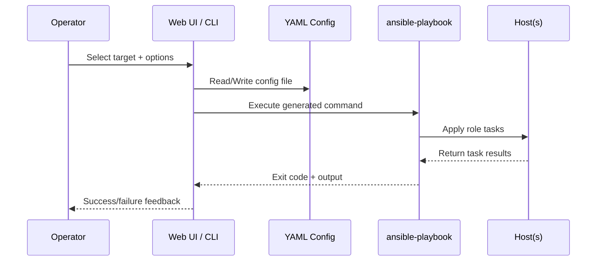

# Architecture

This system is a layered provisioning platform:

1. **Configuration layer** (`config/*.yaml`)
2. **Orchestration layer** (`tooling/setup_cli.py`, shell wrappers)
3. **Execution layer** (Ansible playbooks and roles)
4. **Operator UX layer** (`webapp/`)

The design emphasizes idempotency, composability, and explicit operator intent.

## High-Level Component Diagram

```mermaid
flowchart TD
  U[Operator] --> CLI[tooling/setup_cli.py]
  U --> WEB[webapp/app.py]
  WEB --> CFGGEN[config/web-generated.yaml]
  CLI --> CFG[config/*.yaml]
  CLI --> PB[playbooks/dev.yml|vps.yml]
  PB --> ROLES[roles/common dev dotfiles vps reverse_proxy]
  ROLES --> HOSTS[localhost or vps hosts]
  PB --> INV[inventory/vps.ini]
```

## Repository Topology

```text
setup/
  config/
    defaults.yaml
    local.yaml                 # user-created override
    web-generated.yaml         # generated by web UI
  inventory/
    vps.example.ini
    vps.ini                    # user-created inventory
  playbooks/
    dev.yml
    vps.yml
  roles/
    common/
    dev/
    dotfiles/
    vps/
    reverse_proxy/
  scripts/
    bootstrap.sh
    run-dev.sh
    run-vps.sh
  tooling/
    setup_cli.py
  webapp/
    app.py
    templates/index.html
  tests/
```

## Layer Responsibilities

### Configuration Layer

- Stores desired state and feature toggles.
- Separates defaults from environment-specific values.
- Keeps parameters close to domain concepts (`vps.ufw.allow`, `dotfiles.stow_folders`).

### Orchestration Layer

- Validates and constructs deterministic commands.
- Ensures target-specific requirements (inventory for `vps`).
- Provides execution controls (`--check`, `--limit`, `--print-only`).

### Execution Layer

- Applies state changes via Ansible roles.
- Supports partial composition via role boundaries.
- Keeps tasks idempotent wherever possible.

### Operator UX Layer

- Captures input quickly for common setup needs.
- Generates machine-readable config.
- Shows exact runnable command for transparency.

## Control/Data Flow Sequence



## Design Decisions

- **Ansible as engine**: mature idempotent provisioning and remote orchestration.
- **Python CLI**: safer command construction than ad-hoc shell scripts.
- **Role granularity**: easier extension and isolated testing.
- **Config-first model**: all behavior derives from explicit YAML.
- **Web app as accelerator**: convenience without hiding commands.

## Security Boundaries

- Configuration and command generation are local operations.
- Remote changes happen only through explicit Ansible execution.
- Secrets are intentionally kept outside tracked files (`secrets/` is gitignored).

## Extensibility Model

- Add role under `roles/<name>/tasks/main.yml`.
- Wire role into relevant playbook.
- Add matching config section in YAML.
- Update CLI and docs only if new execution semantics are introduced.
