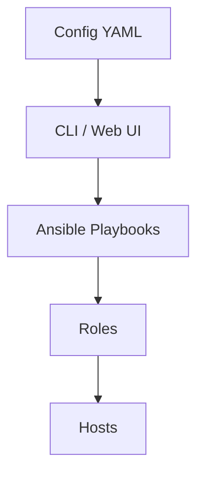
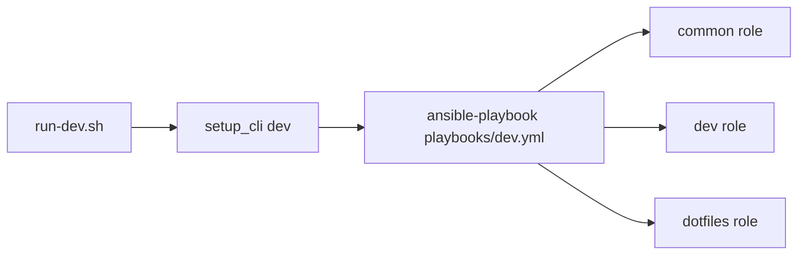
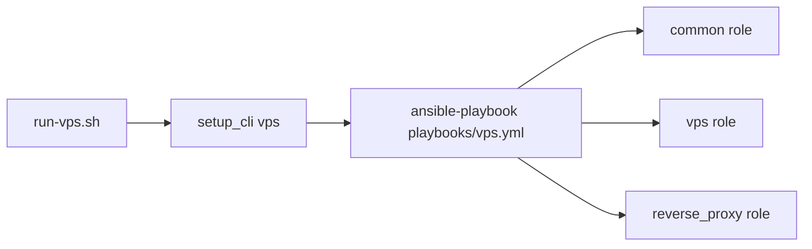
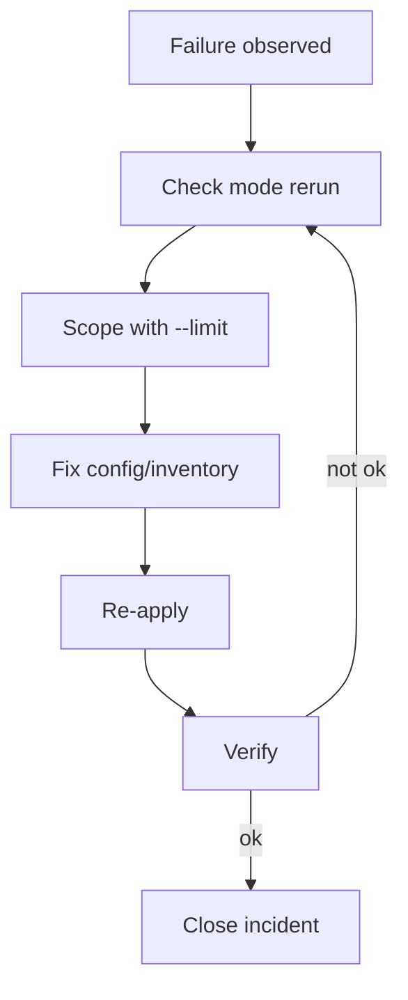

# Diagram Snippets

Reusable Mermaid snippets for issue discussions, design docs, or PR descriptions.

## 1) Layered Architecture



## 2) Dev Setup Pipeline



## 3) VPS Setup Pipeline



## 4) Incident Response Loop



## Optional Excalidraw Snippet Template

If you want a visual whiteboard style, paste this markdown block in docs and replace with an exported PNG/SVG from Excalidraw:

```markdown

```

Use this naming convention for assets:

- `docs/assets/<topic>-excalidraw.svg`
- `docs/assets/<topic>-excalidraw.png`
