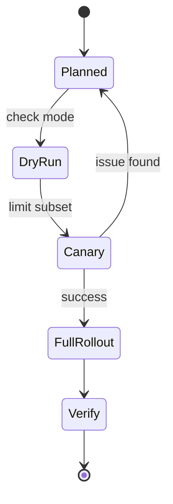

# Operations Runbook

This runbook covers common operator procedures and incident patterns.

## Standard Commands

### Bootstrap

```bash
./scripts/bootstrap.sh
```

### Dev Setup

```bash
./scripts/run-dev.sh --config config/local.yaml
```

### VPS Setup

```bash
./scripts/run-vps.sh --config config/local.yaml --inventory inventory/vps.ini
```

### Dry-Run

```bash
./scripts/run-vps.sh --config config/local.yaml --inventory inventory/vps.ini --check
```

## Change Management Pattern

1. Edit config in a dedicated environment file.
2. Print command (`--print-only`).
3. Dry-run (`--check`).
4. Apply in canary scope (`--limit`).
5. Roll out to full target set.

## Operational Diagram



## Troubleshooting Guide

### SSH connection failures

- Confirm host/IP in inventory.
- Confirm SSH key exists and is accepted.
- Confirm firewall allows SSH port in `vps.ufw.allow`.
- Test manually: `ssh <user>@<host> -p <port>`.

### Package install failures

- Check distro package names (especially cross-distro scenarios).
- Verify apt cache health on host (`apt-get update`).
- Re-run with focused limit on failing host.

### Reverse proxy not routing

- Confirm domain DNS points to host.
- Confirm upstream process listens on configured port.
- Validate generated Caddyfile content and restart status.

## Post-Provision Verification

- SSH login policy matches expectation.
- Password auth disabled when configured.
- UFW status enabled and expected ports open.
- Caddy running and serving domain routes.
- Dotfiles applied correctly on local dev machine.

## Backup and Rollback Considerations

- SSH config edits use backups from Ansible `lineinfile`.
- Keep snapshots/image backups for VPS before major transitions.
- For risky changes, stage via canary host first.

## SRE-Friendly Enhancements (Next Iteration)

- Add role tags for targeted reruns.
- Add CI checks with `ansible-lint`.
- Add Molecule tests for role behavior.
- Add health-check probes after reverse proxy updates.
