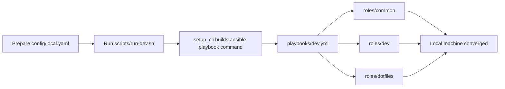
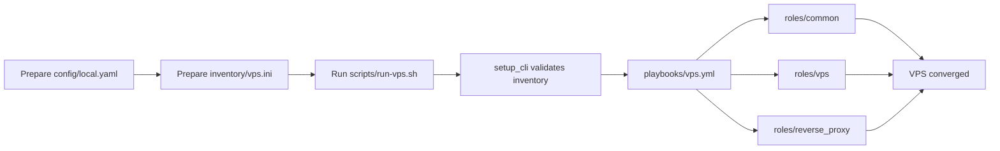

# Provisioning Flows

This document describes operational flows for each target and recommended execution patterns.

## Target Matrix

| Target | Scope | Transport | Requires Inventory | Typical Use |
|---|---|---|---|---|
| `dev` | local machine | local Ansible connection | No | bootstrap workstation/laptop |
| `vps` | remote hosts | SSH | Yes | provision internet-facing servers |

## Flow Diagram: Dev Provisioning

## Flow Diagram: VPS Provisioning

## Recommended Execution Lifecycle

1. **Bootstrap environment**
   - `./scripts/bootstrap.sh`
2. **Create environment config**
   - `cp config/defaults.yaml config/local.yaml`
3. **Preview commands**
   - `./scripts/run-dev.sh --config config/local.yaml --print-only`
   - `./scripts/run-vps.sh --config config/local.yaml --inventory inventory/vps.ini --print-only`
4. **Run dry checks**
   - `./scripts/run-dev.sh --config config/local.yaml --check`
   - `./scripts/run-vps.sh --config config/local.yaml --inventory inventory/vps.ini --check`
5. **Apply desired state**
   - same commands without `--check`
6. **Verify host posture**
   - SSH policy, firewall rules, reverse proxy route behavior

## Zero-to-VPS Checklist

- [ ] DNS records for domains point to VPS IP.
- [ ] SSH key authentication works for root/bootstrap user.
- [ ] Inventory entries include reachable `ansible_host` values.
- [ ] `vps.disable_password_auth` left `true` unless explicitly needed.
- [ ] `vps.ufw.allow` includes SSH and app ingress ports.
- [ ] Reverse proxy domain/upstream mapping matches running app.

## Partial Rollout Patterns

- **Single host canary**:
  - `--limit your-server`
- **Subset of group**:
  - `--limit vps[0]`
- **Role-limited test (advanced)**:
  - use playbook tags if you add tags to tasks in future iterations

## Failure Recovery Pattern

1. Re-run with `--check` to inspect drift and planned actions.
2. Validate inventory connectivity and SSH auth.
3. Narrow scope with `--limit`.
4. Re-apply once blocking issue is resolved.

Because tasks are idempotent, replay is the primary recovery mechanism.
