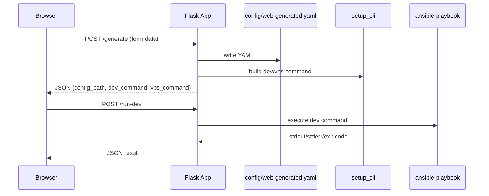

# Web App Guide

The web app provides a fast operator UI for generating setup configuration and provisioning commands.

## Start

```bash
python -m webapp.app
```

Open: `http://127.0.0.1:8080`

## Capabilities

- Capture common `common`, `dotfiles`, `dev`, and `vps` settings.
- Write generated config to `config/web-generated.yaml`.
- Display fully resolved commands for `dev` and `vps`.
- Execute `dev` target from UI (`/run-dev` endpoint).

## Request/Response Overview



## Safety Characteristics

- Commands are generated by typed backend code, not free-form shell from UI.
- `vps` action is command preview only (copy/paste model) to reduce accidental remote changes.
- `run-dev` returns bounded output snippets for UI readability.

## Extending the UI

- Add new form controls in `webapp/templates/index.html`.
  - Mirror fields in `build_config_from_form()` in `webapp/app.py`.
- For new provisioning targets:
  - Add target playbook.
  - Extend CLI command builder.
  - Add endpoint and UI actions.

## Known Constraints

- Current UI assumes one reverse-proxy domain row.
- No auth layer (designed for local trusted execution).
- No async job queue for long-running execution yet.

## Suggested Upgrades

- Add dynamic multi-domain row editor.
- Add run history and downloadable logs.
- Add config profile save/load support.
- Add dry-run toggle in UI before apply.
